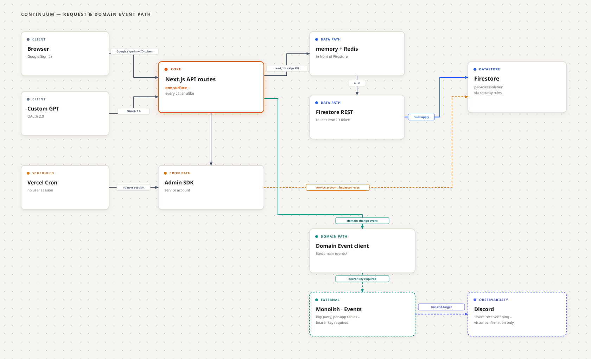

<h1 align="center">Continuum — One Dashboard. Everything You Track.</h1>

<p align="center">
  <a href="https://github.com/fal3n-4ngel/Continuum-Home/issues"></a>
  <a href="https://github.com/fal3n-4ngel/Continuum-Home/stargazers"></a>
  <a href="https://github.com/fal3n-4ngel/Continuum-Home"></a>
  <a href="https://github.com/fal3n-4ngel/Continuum-Home/blob/main/LICENSE"></a>
</p>


<p align="center">
  <a href="https://continuum-home.vercel.app/"><strong>🚀 Try Continuum Live Demo</strong></a>
</p>

---

## What is Continuum?

Continuum is a self-hostable personal data platform for tracking finances, investments, media, books, and subscriptions—with a unified REST API designed for both modern web apps and AI assistants.

```text
                    Continuum
                        │
             ┌──────────┼──────────┐
             │          │          │
          Finance     Media       Life
             │          │          │
         Expenses     Movies     Notes
         Portfolio    Anime      ...
         Subs         Books
             │          │
             └──────────┼──────────┘
                        │
                  Continuum API
                        │
              ┌─────────┼─────────┐
              │         │         │
           Web App   ChatGPT    Other
                                Clients
```

The API is the source of truth; AI clients interact through standard authenticated endpoints via an OpenAPI schema.

---

## Features

- **💰 Expense Ledger**: Transaction tracking with customizable pay cycles, multi-currency support, date range and category filtering, analytics, and CSV import/export.
- **📈 Investment Portfolio**: Multi-asset tracking across Equities, Crypto, Mutual Funds (live NAV via AMFI), SIPs, Gold, Cash, and Fixed Deposits with live valuation and compounding calculators.
- **🎬 Media Watchlist**: Unified tracking for movies, shows, and anime with progress tracking and integrations with AniList, Trakt, OMDb, and Letterboxd imports.
- **📚 Book Library**: Personal book tracker with reading progress backed by OpenLibrary.
- **💳 Subscription Tracker**: Normalize billing cycles across weekly, monthly, and annual renewals with effective monthly burn analysis.
- **🤖 AI Native**: Manage data conversationally via OpenAPI 3.1 schema (`/api/openapi.json`) and OpenAI Custom GPT actions.

---

## Tech Stack & Architecture

- **Frontend & Server**: Next.js 16 (App Router, Turbopack) + React 19 + TypeScript + Tailwind CSS
- **Database & Auth**: Firebase (Google Sign-In + Firestore REST API)
- **Security**: AES-256-GCM encryption on sensitive fields; zero admin credentials in backend (all writes execute using the caller's Firebase ID token subject to Firestore security rules); SSRF-guarded upstream integrations.
- **Telemetry**: Audit events stream out to a dedicated ingestion service storing structured logs in BigQuery.



---

## AI Integration (ChatGPT Actions)

Continuum exposes an OpenAPI 3.1 specification at `/api/openapi.json`. This allows external AI clients or Custom GPTs to create transactions, look up assets, and log watchlist items via authenticated HTTP requests.

- **Public GPT**: [Continuum Assistant](https://chatgpt.com/g/g-6a60b01e38c8819187662d1e42c6bee7-Continuum-Home-public)
- **Self-Hosted Setup**: See [`CUSTOM_GPT_INSTRUCTIONS.md`](CUSTOM_GPT_INSTRUCTIONS.md) for step-by-step GPT configuration, OAuth settings, and the system prompt.

---

## Getting Started

### 1. Clone & Install

```bash
git clone https://github.com/fal3n-4ngel/Continuum-Home.git
cd Continuum-Home
npm install
```

### 2. Configure Environment & Firebase

Copy the example environment file:
```bash
cp .env.example .env.local
```

Set required variables in `.env.local`:
```env
FIREBASE_CONFIG={"apiKey":"...","authDomain":"...","projectId":"..."}
ENCRYPTION_KEY="your-custom-super-secret-key-phrase"
```

Deploy Firestore security rules:
```bash
firebase login
firebase use <your-project-id>
firebase deploy --only firestore:rules
```

### 3. Run

```bash
# Development
npm run dev

# Production
npm run build
npm run start
```

---

## 👥 Contributors

<table>
<tr>
    <td align="center">
        <a href="https://github.com/fal3n-4ngel">
            
            <br />
            <sub><b>Adithya Krishnan</b></sub>
        </a>
    </td>
</tr>
</table>

## License

This project is open-source and available under the [MIT License](LICENSE). Contributions are welcome—see [CONTRIBUTING.md](CONTRIBUTING.md).

---

## 📝 Authors' Note

> Well, it's been a while since I worked on any public projects—mostly coz I rarely get time after work, and even when I do, it's usually personal APIs or portfolio updates.
>
> I already had a system to track my expenses and movies via my personal API, which I enhanced when ChatGPT released Custom GPTs so I could add stuff directly via chat (use AI without paying for an API). Instead of putting AI inside my API, I put my API inside AI (sounded cool in my head).
>
> Anyway, a friend saw it and wanted it too, so rather than handing over my personal API collection, I decided to build a proper dashboard instead, Most of UI is just Antigravity, but fear not I did put a lot of effort and time in the core logic and flows so it's not a vibe coded 'slop'. And here we are!
>
> Anyways, hosting a custom gpt is kinda costly so not sure how long I might keep that up, feel free to host your own one or sponsor me via the button below :)

<a href="https://www.buymeacoffee.com/fal3n-4ngel" target="_blank"></a>
