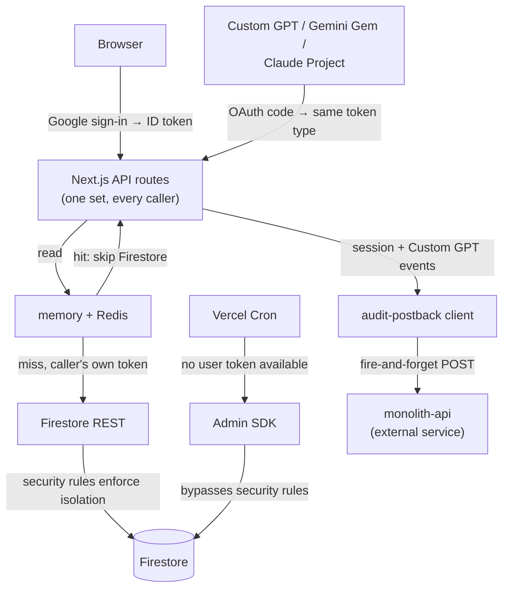

<h1 align="center"> Continuum — One Dashboard. Everything You Track. </h1>
<h1 align="center">

  <br>
  <div>
    <a href="https://github.com/fal3n-4ngel/Continuum-Home/issues">
        
    </a>
    <a href="https://github.com/fal3n-4ngel/Continuum-Home/stargazers">
        
    </a>
    <a href="https://github.com/fal3n-4ngel/Continuum-Home">
        
    </a>
    <a href="https://github.com/fal3n-4ngel/Continuum-Home/blob/main/LICENSE">
        
    </a>
    <br>
    </div>

   </h1>

## What is Continuum?
Continuum is a self-hosted, privacy-first dashboard that replaces a pile of single-purpose tracking apps — budget spreadsheet, Letterboxd, Goodreads, subscription reminders — with one place to manage expenses, investment portfolios, media watchlists, book libraries, and recurring subscriptions.<br/>It started as a personal API I fed into a Custom GPT so I could log expenses over chat instead of paying for another app. A friend wanted it too, so instead of handing over my personal API collection I built an actual dashboard around it. It's designed to natively integrate with AI assistants through a standardized OpenAPI schema.

## Technical Details

```
Framework: Next.js 16 (App Router, Turbopack) + React 19 + TypeScript
Styling: Tailwind CSS
Database & Auth: Firebase (Google Sign-In + Firestore REST API)
Architecture: Modular Domain-Driven Subdirectories (lib/audit-postback, lib/auth, lib/cron, lib/finance, lib/firebase, lib/integrations, lib/utils)
```

## Features
- Expense ledger with categorized transactions, location-specific currencies, and custom financial-period filtering.
- Investment portfolio tracking across equities, crypto, mutual funds/SIPs, gold, cash, and fixed deposits — manual entry or live valuation.
- Unified media watchlist with bidirectional AniList and Trakt sync, Letterboxd CSV imports, and metadata enrichment via OMDb and TVMaze.
- Book library backed by the OpenLibrary API with reading-progress tracking.
- Subscription tracker that normalizes monthly and annual costs into a true effective monthly spend.
- Auto-saving scratchpad for quick, persistent notes.
- Built-in OpenAPI 3.1 schema for Custom GPT Actions, Gemini Gems, or Claude Projects — add expenses, log media, or update your portfolio in plain English.
- Real-time audit postback module (`lib/audit-postback/`) for login session auditing and Custom GPT action tracking.
- AES-256-GCM encryption on sensitive fields, with no admin service account — every request is authenticated with the caller's own Firebase ID token.

## Project Structure

```
lib/
├── audit-postback/    # Ingest client, session throttling, Custom GPT action detector
├── auth/              # Auth session, tokens, credentials, OAuth clients, unsubscribe logic
├── cron/              # Cron execution guards, scheduling, Discord alerting
├── finance/           # Asset pricing, fixed deposit calculations, subscription logos, metrics
├── firebase/          # Firestore REST client, admin SDK, sync-push, Zod validators
├── integrations/      # AniList, Trakt, Discord Webhooks, Gemini AI Budget
└── utils/             # Dates, formatters, encryption, cache, redis, errors, route-handlers, site config
```

## Architecture

Every caller — a signed-in browser or an external AI client that completed the OAuth flow — ends up with the same kind of bearer token and hits the same API routes; there is no separate "AI" surface. Those routes read through an in-memory + Redis cache in front of Firestore, using the *caller's own* ID token, so per-user isolation is enforced by Firestore security rules rather than app code. Crons are the one exception: they have no user token to act with, so they carry a service account through the Admin SDK instead, which bypasses those same rules.

The other structural decision is that audit telemetry leaves the building entirely: `lib/audit-postback` doesn't write to this app's own Firestore, it posts to **monolith-api**, a separate service this app has no further visibility into. Route handlers also call out to Trakt, AniList, OMDb, and Gemini for sync, enrichment, and the AI assistant — those are plain leaf API calls, not part of the request's control flow, so they're omitted below.



## Run Using Node.js

### Clone the Repository

```bash
git clone https://github.com/fal3n-4ngel/Continuum-Home.git
cd Continuum-Home
```

### Install Dependencies

```bash
npm install
```

### Configure Firebase

1. Create a project in the [Firebase Console](https://console.firebase.google.com).
2. Enable **Google Sign-in** under **Authentication** → **Sign-in method**.
3. Provision a **Firestore Database**.
4. **Project Settings** → **General** → **Add Web App** to generate the config snippet.
5. Deploy the security rules that isolate each user's data:

```bash
npm install -g firebase-tools
firebase login
firebase use --add
firebase deploy --only firestore:rules
```

### Set Environment Variables

```bash
cp .env.example .env.local
```

Set `FIREBASE_CONFIG` as a minified JSON string and pick an encryption key in `.env.local`:

```env
FIREBASE_CONFIG={"apiKey":"...","authDomain":"...","projectId":"..."}
ENCRYPTION_KEY="your-custom-super-secret-key-phrase"
```

Optional keys for Trakt, AniList, and OMDb can also go here — see [`.env.example`](.env.example).

> [!TIP]
> **Bring-your-own-config mode:** server-wide env vars for third-party APIs are optional. Users can instead supply their own credentials per-request via HTTP headers (`X-Firebase-Config`, `X-Trakt-Client-Id`, etc.) — see `lib/auth/credentials.ts`.

### Run the Development Server

```bash
npm run dev
```

### Run the Production Server

```bash
npm run build
npm run start
```

### Access the Website

Open your browser and navigate to

```bash
http://{ip}:3000
```

## 🔒 Security Model

- **No admin service account.** The backend never holds elevated database credentials — every write is routed through the [Firestore REST API](https://firebase.google.com/docs/firestore/use-rest-api), authenticated with the caller's own Firebase ID token.
- **AES-256-GCM encryption** on sensitive fields (titles, categories, amounts, notes) before they hit Firestore.
- **Per-user isolation** enforced by ownership checks in `firestore.rules`.
- **Hardened API routes** — payloads are validated at the boundary, and upstream proxy routes are strictly allowlisted against SSRF.

## 🤖 Talk to Continuum via ChatGPT

Continuum exposes an OpenAPI schema (`/api/openapi.json`) so you can add expenses, log media, or check your portfolio from a chat window instead of the UI. Requests originating from ChatGPT Actions are automatically detected (`isCustomGptRequest`) and recorded in audit telemetry.

### Official Public Custom GPT
Open the **[Continuum Assistant](https://chatgpt.com/g/g-6a60b01e38c8819187662d1e42c6bee7-Continuum-Home-public)**. Authorization runs through standard OAuth 2.0 on your first prompt.

<details>
  <summary><strong>Configure a Custom GPT for your own self-hosted instance</strong></summary>

1. In ChatGPT: **Explore GPTs** → **Create** → **Configure** → **Actions**.
2. **Import Schema:** point it at `https://your-domain.com/api/openapi.json`.
3. **Configure Authentication** → **OAuth**:
   - **Client ID & Secret:** any dummy strings (e.g. `client` / `secret`).
   - **Authorization URL:** `https://your-domain.com/api/oauth/authorize`
   - **Token URL:** `https://your-domain.com/api/oauth/token`
   - **Token Exchange Method:** `Default (POST request)`.
4. **Instructions:** paste the contents of [CUSTOM_GPT_INSTRUCTIONS.md](CUSTOM_GPT_INSTRUCTIONS.md).
5. Save and publish.

</details>

## Troubleshooting

### 1. Portfolio / expense data won't decrypt, or looks garbled
- Symptoms
  + Fields render as blank or as raw ciphertext
  + Data written before now still won't read back correctly
- Troubleshooting Steps
  ```node
  # ENCRYPTION_KEY must stay identical for the lifetime of your data —
  # changing it makes everything encrypted under the old key unreadable.
  # Confirm .env.local matches what was used when the data was written.
  ```

### 2. Google Sign-in fails or Firestore requests get rejected
- Symptoms
  + Login redirects back to the login screen
  + API routes return 401/403
- Troubleshooting Steps
  ```node
  # Confirm Google Sign-in is enabled in Firebase Console → Authentication
  # Confirm `firebase deploy --only firestore:rules` was run against the right project
  # Confirm FIREBASE_CONFIG in .env.local matches the same Firebase project
  ```

### 3. Daily cron emails / Custom GPT Actions aren't firing
- Symptoms
  + No daily portfolio/expense/subscription emails
  + Custom GPT Action calls fail silently
- Troubleshooting Steps
  ```node
  # Confirm CRON_SECRET and RESEND_API_KEY are set in your deployment env
  # Confirm the GitHub Actions cron workflows have APP_URL and CRON_SECRET as repo secrets
  # Check /api/cron/health for a live status check
  ```

# Contributors

<table>
<tr>
    <td align="center">
        <a href="https://github.com/fal3n-4ngel">
            
            <br />
            <sub><b>Adithya Krishnan</b></sub>
        </a>
    </td>
   </tr>
</table>

## License
This project is open-source and available under the [MIT License](LICENSE).

Interested in improving Continuum? I welcome contributions! See [CONTRIBUTING.md](CONTRIBUTING.md) for issue/branch conventions and CI requirements, or just open an issue, submit a PR, or share ideas on GitHub. Together, we can make this project even better.

---

## 📝 Authors' Note

> Well, it's been a while since I worked on any public projects—mostly coz I rarely get time after work, and even when I do, it's usually personal APIs or portfolio updates.
>
> I already had a system to track my expenses and movies via my personal API, which I enhanced when ChatGPT released Custom GPTs so I could add stuff directly via chat (use AI without paying for an API). Instead of putting AI inside my API, I put my API inside AI (sounded cool in my head).
>
> Anyway, a friend saw it and wanted it too, so rather than handing over my personal API collection, I decided to build a proper dashboard instead. And here we are!
>
> Anyways, hosting a custom gpt is kinda costly so not sure how long I might keep that up, feel free to host your own one or sponsor me via the button below :)

<a href="https://www.buymeacoffee.com/fal3n-4ngel" target="_blank"></a>

<!-- GitAds-Verify: 1VTRJ98N18CZX9P4A3NYHVY5CBSXTDFB -->

## GitAds Sponsored
[](https://gitads.dev/v1/ad-track?source=fal3n-4ngel/continuum-home@github)
